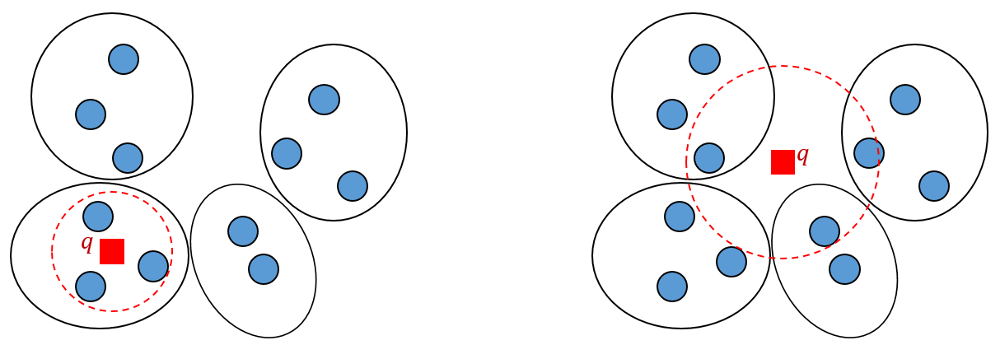
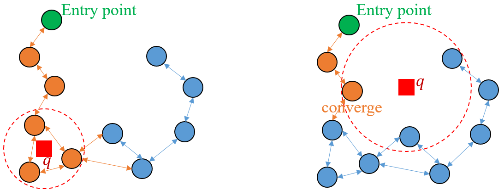
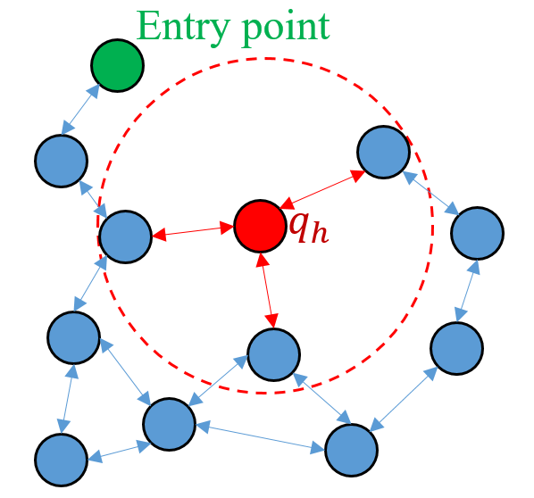
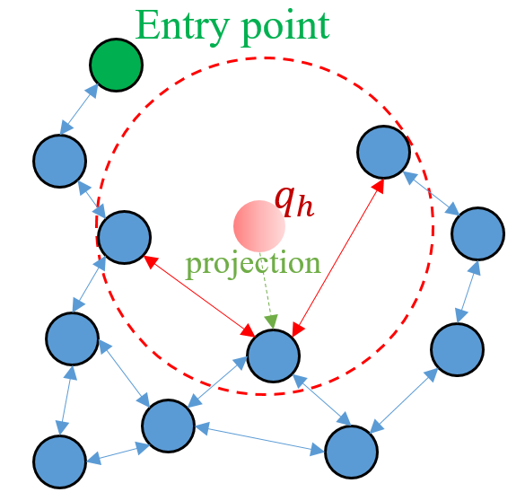
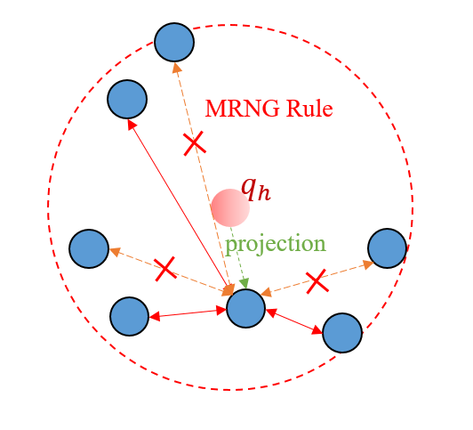
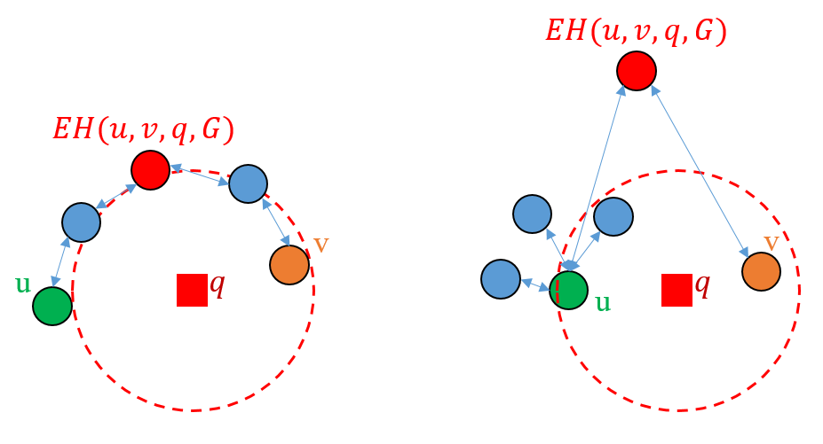

# OOD查询
分布外（OOD）查询是近年向量检索领域中的新问题，由于目前相关教程较少，所以写了这篇文章来介绍OOD查询以及讲解目前如何为OOD查询设计图索引。同时介绍一下我们在OOD查询上的工作。

现实中最常见的OOD查询为跨模态检索，例如使用CLIP将图片和文本映射到同一向量空间后，图片向量和文本向量仍然具有模态差异。假设现在对图片向量建立ANN索引，使用文本向量作为查询进行图文搜索时，由于查询分布与base data分布不同，查询的recall@k-QPS tradeoff会非常差。

OOD查询的一个重要特征是查询 $q$ 的1NN与查询本身距离较远，下图中给出了IVF索引处理两种不同查询时的例子，左图为分布内（ID）查询，右图为OOD查询。
1. 对于ID查询，由于 $q$ 距离其1NN较近，很容易落到簇内，此时很容易就能找到 $q$ 的大部分 $k$ NN；
2. 而对于OOD查询， $q$ 距离其1NN非常远，扫描一个簇只能找到 $q$ 的少部分 $k$ NN，需要扫描很多簇才能找到 $q$ 的大部分 $k$ NN。

对于IVF索引，在真实数据集上在处理ID查询时，仅仅需要扫描小于5%的簇就能达到足够的准确率；但是对于OOD查询，往往需要扫描30%以上的簇才能达到一个较高的准确率。

# 为OOD查询设计ANN索引

## 传统图索引的问题
由于目前ANN索引主要为IVF和Graph。但是目前学术界对OOD场景下的IVF索引研究较少，所以这节重点介绍图索引如何解决OOD查询，我们在图索引上使用最常用的贪心算法进行搜索，即每hop探索candidate中距离查询最近的点。

我们首先介绍传统图索引（HNSW，NSG等）在处理OOD查询时的问题。下图给出了图索引在处理不同分布查询的例子，其中橙色表示贪心算法探索到的点或边：

1. 左图为ID查询，由于其距离base data较近，图索引很容易就能搜索到查询 $q$ 的全部 $k$ NN；

2. 右图为OOD查询，由于OOD查询 $q$ 距离base data较远，同时其 $k$ NN分散在各处，贪心搜索只搜索到其中一个 $k$ NN后，发现该点的邻居中没有距离查询最近的点，便直接收敛了，最终导致三个 $k$ NN中只找到了一个。一种简单的解决方案是增大搜索队列大小（即HNSW中的efs），放宽收敛条件，但是会导致搜索的性能严重下降。

从理论上来讲，目前大部分图索引都是在近似MRNG或者近似MRNG的变种（例如Vamana， $\tau$ -MG， $\alpha$ -CG等），即在建图时使用三角裁边。我们用 $N_{i,q}$ 表示查询 $q$ 的第 $i$ 个最近邻， $\delta(u,v)$ 为 $u$ 到 $v$ 的距离。MRNG可以保证当 $\delta(N_{1,q},q) = 0$ 时贪心搜索能找到 $N_{1,q}$ ； $\tau$ -MG可以保证当 $\delta(N_{1,q},q) \le \tau$ 时贪心搜索能找到 $N_{1,q}$ ，并且 $\tau$ 是一个较小的常数。这些图索引可以在查询距离base data较近时提供理论支持，但是由于OOD查询距离base data较远，这些理论并不适用于OOD查询。

既然查询与base data的分布不同，那么单纯从base data角度进行图索引优化就不太现实了，那么解决方案肯定就是使用历史查询来辅助建图，让图索引能够获得另一个查询分布的信息。我们下文使用 $q_h$ 来表示历史查询（即训练集），使用 $q_t$ 来表示测试查询。

## OOD-DiskANN (RobustVamana)

RobustVamana的解决方案非常简单，就是将 $q_h$ 直接添加到图中，查询时利用 $q_h$ 进行导航，但是不将 $q_h$ 加入结果中，下图是一个例子：将 $q_h$ 加入图索引中， $q_h$ 的三个分散的 $k$ NN被 $q_h$ 连接在了一起，在图上搜索时就可以通过 $q_h$ 从一个区域探索到另一个较远的区域。

该索引易于理解，但是问题也很明显：如果 $q_h$ 数量少，图索引未能充分学习到查询分布信息，效果不好；如果 $q_h$ 数量多，图索引在搜索时会访问到大量的 $q_h$ ，搜索路径延长很多，导致性能下降。

## RoarGraph

为了解决上述RobustVamana的问题，RoarGraph主要通过projection的操作来避免将点直接添加到图索引中。下图中给出了一个例子，RoarGraph将 $q_h$ 投影到 $N_{1,q_h}$ （即距离 $q_h$ 最近的base data），并将原先与 $q_h$ 连接的边改为与 $N_{1,q_h}$ 连接。RoarGraph同样会为每个点设置出度上限，并使用MRNG策略在投影时对每个点进行裁边。

当然上述只是对RoarGraph的简要介绍，实际RoarGraph先在历史查询集合与base data之间建立二分图，然后再进行投影操作为每个点获取邻居，最后再使用与NSG类似的方法进行建图（实际是将NSG的近似KNN图换为投影操作后的Projected Graph）。具体的算法可见[https://arxiv.org/abs/2408.08933](https://arxiv.org/abs/2408.08933)。

但是RoarGraph仍然存在一些问题，最主要的是投影操作将 $q_h$ 投影到 $N_{1,q_h}$ 后，所有与 $q_h$ 相连的边全部连接到了 $N_{1,q_h}$ 上，使得 $N_{1,q_h}$ 边数过多。虽然后续会通过MRNG裁边来降低边数，但MRNG裁边策略并不能为OOD查询提供理论支持，实际上这种裁边使得图索引丢失了一部分查询分布的信息。

## NGFix + RFix

在讲解NGFix和RFix之前，我们首先介绍高维空间图索引上贪心搜索的一个重要特征（由于现实场景下需要召回的 $k$ NN数量往往较高，所以我们后面均认为 $k \ge 10$ ），即贪心搜索分为下面两个阶段：

1. 从入口接近查询附近的阶段。无论入口点如何选择，这一阶段的时间占比极小，在真实环境下，往往只需要几个hop即可到达查询附近。这一点可以用MRNG上的单调路径平均长度为 $O(n^{\frac{1}{d}}log(n^{\frac{1}{d}}))$ 来解释，其中 $d$ 表示维度，由于在高维空间中， $d$ 是个较大的值，所以 $n^{\frac{1}{d}}$ 增长非常慢，使得路径的平均长度较小。

2. 在查询附近进行搜索的阶段，该阶段是搜索性能的主要瓶颈。想要搜索到大部分的 $k$ NN，往往需要几十个甚至几百个hop。

假设我们设置搜索队列大小 $efs=L$ ，则在MRNG上搜索的时间复杂度可以近似表示为 $O(Mn^{\frac{1}{d}}logn + MdL)$ ，其中 $M$ 表示图的平均出度。式子的左边为搜索第一阶段时间复杂度，右边为搜索第二阶段时间复杂度，在第二阶段中，我们通过调整 $efs$ 来控制recall和latency的tradeoff。但是在OOD场景下，我们需要将 $efs$ 设置为几百甚至几千才能达到较高的recall。

下面我们解释为什么OOD场景下 $efs$ 需要设置的很高才能到达高recall，首先我们知道目前的图索引（例如NSG）保证了从入口点出发能到达所有点，但是该点可达并不代表该点容易被搜到，下图给出了两个示例。左图虽然从 $u$ 到达 $v$ 的路径长，但容易到达 $v$ ，因为贪心搜索不容易陷入局部最优；右图虽然从 $u$ 到达 $v$ 的路径短，但是图中的红色点距离查询较远，贪心搜索并不会去探索它，而是会优先选择一些较近的点进行探索，使得贪心搜索很难到达 $v$ 。

我们可以将上述的搜索难度用公式表达为：

$$EH(u,v,q,G) = \underset {p \in P(u,v,G)}{min} \underset {x \in p}{max} F_{x,q}$$ 

其中 $EH(u,v,q,G)$ 表示对于查询 $q$ ，在图索引 $G$ 中，从 $u$ 搜到 $v$ 的困难程度。 $P(u,v,G)$ 表示 $G$ 中 $u$ 到 $v$ 的所有路径集合， $F_{x,q}$ 表示 $x$ 是 $q$ 的第 $F_{x,q}$ 个近邻。

$EH(u,v,q,G)$ 表示贪心搜索从 $u$ 走到 $v$ 需要经过的距离查询最远的点（即上图中的红点）。一个简单的定理是：当 $efs \ge EH(u,v,q,G)$ 时，从 $u$ 点出发的贪心搜索一定能到达 $v$ 。

根据上述定理，一个显然的想法就是让历史查询的所有近邻间的 $EH$ 都较低。我们先定义当 $EH(u,v,q,G) \le K_h$ 时， $u$ 到达 $v$ 是容易的， $K_h$ 是一个自定义的参数。同时我们定义 $N_q$ 为需要考虑的近邻数量，那么我们的目标如下：

$$\forall i, \forall j, 1 \le i < j \le N_q, EH(N_{i,q},N_{j,q},q,G) \le K_h$$

我们考虑一个新的图 $NG_{N_q,q}$ ，边 $(u,v) \in NG_{N_q,q}$ 当且仅当： $EH(u,v,q,G) \le K_h$ 且 $u$ 和 $v$ 是 $q$ 的前 $N_q$ 个近邻。我们在 $NG_{N_q,q}$ 中添加边，使得 $NG_{N_q,q}$ 强连通，并将在 $NG_{N_q,q}$ 添加的边同时添加到 $G$ 中，即可达到我们上面定义的目标。

为了达到上述目标，一种自然的想法是添加尽可能少的边来达到上述目标，但这在测试集上效果并不好，原因有以下两点：（1）对于单个历史查询添加的边太少，图索引还是不能充分利用查询信息。（2）图索引上连边还应该考虑距离关系，只考虑可达性是不够的。

既然要考虑距离关系，那么第二种想法就是给每条边 $(u,v)$ 定义边权，权值为 $\delta(u,v)$ 。目标改为添加边使得 $NG_{N_q,q}$ 强连通并且添加的边权和最小。然而我们可以证明该问题可以归约到哈密顿回路问题，即使 $N_q$ 值较小（ $N_q \le 100$ ）也无法快速解决。另一个原因是添加的边仍然不够多，使用一些近似算法后会发现在测试集上效果仍然不够好。

这个问题的突破点是：最小生成树（边权为距离）是Relative Neighborhood Graph（RNG）的子图。而RNG目前已在图索引中被广泛应用（MRNG就是RNG的扩展），并且实验效果非常好。所以一个思路就是使用最小生成树的思路来达成上述目标，但这里存在一个问题：最小生成树只在无向图中存在，但是 $NG_{N_q,q}$ 是有向图。解决方案也很简单，使用kruskal算法，但是将算法中的维护并查集换成维护传递闭包。这样对于每个历史查询，算法最多添加 $2(N_q-1)$ 有向边，在添加适量边的同时让图索引充分利用了查询信息。

当然对于搜索的第一阶段，还是会存在少部分的查询使得搜索卡在第一阶段，无法到达查询附近。对于这种情况，我们使用RFix进行修复，RFix的思想很简单，就是先以 $efs=N_q$ 进行一次贪心搜索，如果搜索未能进入查询附近，则扩展搜索得到的局部最优点的邻居列表，下图是一个示例，紫色边为新加的边。

值得注意的是，我们只在HNSW的底层图上进行NGFix和RFix，并将入口点设置为base data的中心，原因是HNSW的上层图在高维空间下其实并没有太大用处。HNSW的上层图只能加速搜索的第一阶段，但是高维空间中搜索第一阶段时长占比很低，上层图的加速效果其实很小，反而让索引变得更加复杂。

其他具体细节以及实验结果可以参考我们的论文。

论文链接：[https://arxiv.org/abs/2510.22316](https://arxiv.org/abs/2510.22316)

代码仓库链接如下，我们还增加了使用RaBitQ-8bits进行进一步优化的选项。

代码仓库：[https://github.com/yuhuifishash/NGFix](https://github.com/yuhuifishash/NGFix)。

# Open Problem

## 更好的裁边策略？

在到达出度上限时，我们使用EH来裁边，即优先保留高EH的边，但实际上这样效果依旧有限。因为一条边的EH仅对于单个查询有效，不同查询的EH均不同，无法扩展到其他查询上。所以可以考虑如何设计更好的裁边策略，使其能够扩展到其他的查询上。

## 更强的理论支持？

一个自然的想法是能否将理论扩展为当 $\delta(q_t, q_h) \le \epsilon$ 时，保证 $q_t$ 的搜索准确度。但我们考虑极端情况，base data  $X$ 的 $N$ 个点都聚集在 $q_h$ 附近，任意两个点到 $q_h$ 距离均不同，并且满足：

$$\forall u \in X, |\delta(u,q_h) - \delta(N_{1,q_h}, q_h)| \le \epsilon_0$$  

其中 $\epsilon_0$ 是一个非常小的值，那么在该情况下，保证 $\delta(q_t, q_h) \le \epsilon$ 就需要考虑整个base data  $X$ ，显然是不现实的。

另一个想法是保证当 $\mathcal{N}_{q_t,K_0} \subseteq \mathcal{N}_{q_h, K_1}$ 时，保证 $q_t$ 的搜索准确度（能搜索到 $q_t$ 的前 $K_0$ 个NN），其中 $\mathcal{N}_{q,k}$ 表示查询 $q$ 的前 $k$ 个NN组成的集合。我们可将 $K_1$ 设置为 $K_0$ 的常数倍，即 $K_1 = cK_0$ 。一个问题在于，对于单个查询 $q_h$ ，想要满足上述条件，添加的边数最坏情况为多少？我们有以下两种极端情况：

1. 当 $c=1$ 时，此时即我们论文中讨论的情况，添加的边数最多为 $O(K_1)$ 。

2. 当 $K_0=2$ ， $c$ 为任意值时，此时需要保证 $\mathcal{N}_{q_h, K_1}$ 中的点和边构成Delaunay Graph（DG）。原因在于DG的性质保证：任意两个点有边连接当且仅当存在一个圆经过这两个点且圆中没有其他点。假如边比DG少，那么就会存在一个空圆只经过两点，且这两点间没有边，那么贪心搜索就只能搜索到其中一个 $k$ NN，无法找全两个。由于DG在高维空间中会变成完全图，添加的边数最多为 $O(K_1^2)$ 。

但是对于普遍情况，仍然缺少理论分析与连边算法。尤其是实际中我们可能更关注的 $c=2,K_0=100$ ，  $c=3,K_0=10$ 等情况。

