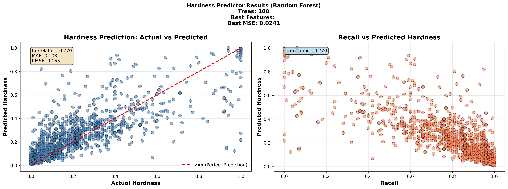
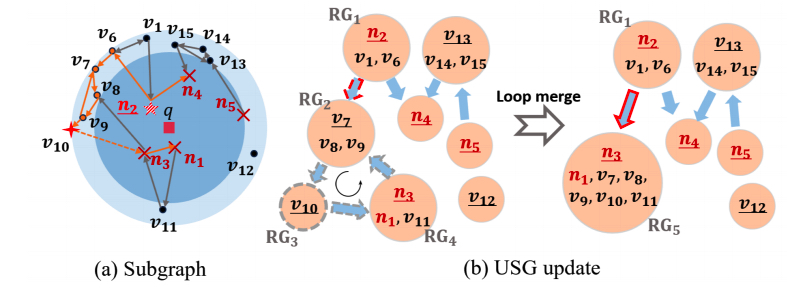

# OOD ANNS with dynamic update

## 我们要解决什么问题？
- 图索引在 OOD 查询时，会面临精度下降/search 开销增加的问题，
- 而多模态使得 OOD-ANNS 场景更广泛
- 像 RoarGraph 这类“离线用大量历史查询做二分图投影+连通性增强”的方法构建重、依赖足量历史查询，且难以适配查询分布漂移。

## Related Works
- OOD-DiskANN
- RoarGraph
- NGFix

## Motivation
- 现有工作的缺点
    - 历史query选择：
        - OOD-DiskANN 和 RoarGraph中 是offline选择，evaluation中使用的全部train querys
        - NGFix 生成能够支持在线选择query来在线update，但是query选择逻辑是random select (从最新query中)
        - 问题：query选择过多会增加图的连通性，导致query latency增加；query选择过少会因为连通性不足导致
    - 并不是"真正"的runtime update —— 只是支持局部重构
        - deletion / insertion 都需要partial rebuild
        - NGFix需要 28.5% 的full-rebuild time for insertion + partial-rebuild；6.8% for deletion + update
        - 这些rebuild的时间内：
            - recall 无法保证
            - 读 + 写同时存在，QPS/Latency 无法保证 (一次性更新的量比较大)

- 我们的目标
    - 真正的 runtime update + OOD
    - 硬件特性?

- Challenges
    - 选择 合适数量 + 需要的query (hard query) 来指导 graph update
    - 将 insert + update / delete + update 分散在时间线上；
        - 删除node的 incoming edge 怎么获取？ 可以不考虑
        - 当前单次 insert / deletion / NGFix update的开销
    - 动态更新
        - 类似NGFix的方法是 定时删除线上20% 的edge + partial rebuild来处理
        - 大范围删除edge会影响图的连通性，造成图的不可用
    - 并发一致性 (读QPS > 写QPS)

## Solutions
- 1. **低成本**检测 hard query (easy query 说明当前的图结构已经很好支持了)
    - stage 0: ml方法：hardness方法([paper](https://arxiv.org/pdf/2505.19001))
        - 方法 GBDT (Gradient Boosted Decision Trees)
            - 论文中的效果：100课树，tree_depth=5/6/7; 推理效果 0.03ms
        - Test效果

        
    
    - stage 1,扰动稳定性 (Jitter) (差异比)
        - 对查询向量做极小扰动 `q' = normalize(q + ε·noise)`, `ε ∈ [0.01, 0.05]`.
        - 再跑一次相同配置，`J = 1 − |R_b(q) ∩ R_b(q')| / k`
        - 阈值 > P90
    
    

- 2. 低成本的近似 EH + Graph update
    - 当前的成本
        - 当前的 EH 计算需要计算矩阵(在subgraph中对每个node pair需要BFS search一遍 => O(M^2) )
        - Graph update 需要执行多次（k < M^2）, 且需要更新EH矩阵 => O(k * M^2)
    
    - 性能瓶颈分析

        - 基于10M数据，1000个queries的测试结果

        | 模块 | 平均延迟 (ms) | P50 (ms) | P95 (ms) | P99 (ms) | 占总时间 | 占所属类别 | 备注 |
        | ---- | ----- | ---- | -------- | -------- | ---------- | ---------- | ---------- |
        | **① EH 矩阵计算（CalculateHardness）** | **0.385** | 0.394 | 0.553 | 0.616 | **34.11%** | – | EH本身较快 |
        | **② 其他逻辑（总计）** | **0.743** | – | – | – | **65.89%** | 100% | 包含2.1~2.3 |
        | ▸ 2.1 f matrix 初始化（Prepare Bitset）| 0.017 | – | – | – | 1.48% | 2.24% | negligible |
        | ▸ 2.2 getDefectsFixingEdges（距离+排序+选边）| **0.616** | 0.541 | 1.241 | 1.328 | **54.67%** | **82.96%** | **最大瓶颈** |
        | ▸ 2.3 Add Edges（锁+add_ngfix_neighbors）| 0.110 | – | – | – | 9.75%  | 14.80% | 随图状态波动 |
        | **③ 总 NGFix 时间** | **1.127** | 1.056 | 1.736 | 2.340 | 100% | – | end-to-end |
    
    - 如何减小 EH 计算量？ 
        - 回归 ANNS query的本质：检索难度 而不是 局部的escape hardness；
            - 从局部的一个node访问到其他全部top-kann node的hardness
            - 局部图的连通性：连通 = 可达 => 按照可达性划分成多个group，增加edge between groups 即可
        - 直观的，减少 M 即可减小 EH矩阵的 size； 而对于相互可达 (hardnes < 阈值τ) 的 kNN pairs，不需要参与计算
            - 类似Steiner-Hardness中 NSG 方法:

            

            - 采取分组策略：2跳内可达的视为相同group; demo 测试了100个query
            ```shell
            Average M (original node count): 100
            Average m (group count): 39.71
            Average reduction: 60.29%
            Min reduction: 23%
            Max reduction: 85%
            Average original EH latency: 371.54 us
            Average grouped EH latency: 235.72 us
            Speedup: 1.57619x
            Original matrix size (avg): 10000
            Grouped matrix size (avg): 1576.88
            Matrix size reduction: 84.2312%
            ```
        
        - 减少subgraph中的 edge 数目：
            - 构造 τ-可达子图 Gt: 在第一遍BFS过程中，“删除”subgraph中的 “明显困难的” 边；（按照与q的距离排序）；
    
    - 如何减小 getDefectsFixingEdges 的计算开销
        - distance 计算 + 排序操作

        ```c
        std::vector<std::pair<float, std::pair<int,int> > > vs;
        for(int i = 0; i < Nq; ++i){
            for(int j = 0; j < Nq; ++j){
                if(f[i][j] == 1) {continue;}
                int u = gt[i];
                int v = gt[j]; 
                float d = getDist(u, v);
                vs.push_back({d,{i,j}});
            }
        }
        std::sort(vs.begin(), vs.end());
        ```

        - 优化EH之后，可以减少 node 的数量，也就可以减少distance计算的数量
        - 排序：其实每一轮只需要得到 distance 最大的结果，所以这里并不需要full sort
        - 多轮处理之间，可以共享这个distance矩阵，避免重复计算

    - 删除节点 A 的 incoming edge 如何获取？
        - 两跳局部扫描（1-hop/2-hop）：候选集合 $𝐶=Γ(𝐴)∪⋃_{𝑢∈Γ(𝐴)}Γ(𝑢)$（A 的邻居 + 邻居的邻居）;对 𝐶 中每个节点检查其出邻接表是否包含 A，有则删。
            - 为什么有效：近邻图的边大多局部（近似 RNG/NSG 结构），指向 A 的边极大概率来自 A 周边的 1–2 跳。
            - 复杂度 graph 出度为M，O(M^2), M 一般不超过 64； 且不需要距离计算，只需要读取 c 的neighbor list
        - 近邻检索候选（“以 A 为查询”的小 ef 搜索） ：用 A 自身向量做一次 小束宽检索（ef ≪ 在线 ef），取前若干近邻节点为候选，检查其出邻接表是否含 A
            - 符合graph生成的过程逻辑
        - 对于可能遗漏的edge，需要实现在线 search 过程中，支持识别 + 删除

- 3. 动态更新 —— 随着时间的推移，以前新增的连通性may“过期”了
    - 当前workload
    - 随机选择node，删除历史 added edge
    - 以node为query，发起查询 -> 更新edge

- 4. 并发一致性
    - runtime delete 的node不能出现在 ANNS 返回结果中

    - 新增node/edge 读写冲突


## Evaluation Test
- query选择：实现相同平均acc下，使用的query数量
    - compare with roargraph and NGFix
- level 0， level 1 的筛选比例，以及最终得到的set vs 使用标准EH的到的sets
- 低成本EH矩阵的到的连通性 vs  标准EH连通性  +  计算开销 compare
- delete node中 两种方法收获的incoming edge比例
- 整体效果的对比：
    QPS vs recall
    Latency vs recall
    QPS vs 读+写
    Latency vs 读写


<!-- ### 1. 相关方向回顾（基于公开文献检索）
#### A. 连接性增强类：RoarGraph 及亲属

RoarGraph 的核心思想是：OOD 查询（尤其是跨模态，比如用文本找图像）在底库向量空间里往往“很孤立”，而且它真正的近邻彼此之间也很疏远。这破坏了传统 HNSW/NSG 假设：局部邻域是密集且连通的。RoarGraph通过构建一个“投影二部图”（projected bipartite graph），让查询模态和目标模态之间出现更多高层跨簇桥，从而保证查询能更快抵达相关区域，而不是在局部稀疏区域里盲走。实验显示它能在 OOD 任务下把高召回延迟显著降下去（在 90% recall 下最高 3.56× 提速）。

问题：
- 它主要解决“可到达性”，不是“相似度质量”。边让你走过去了，但最终打分还是用原生距离度量。跨模态 embedding 的尺度不一致（scale mismatch）和语义偏移没有被修正，所以最后 Top-k 仍可能不是语义上最正确的邻居。
- 它需要额外的跨模态桥边（新增的边会放大search开销），尤其在高召回场景下，候选集必须放大，搜索半径也扩大，导致延迟仍然上升。这对在线服务尤其是高并发下的 tail latency 很痛。
- 增量更新困难：大量预先基于训练集查询添加的边，对于新增数据未必适用。如果持续有新底库向量插入，如何高效地为它们增添跨模态连边是挑战。

#### B. 空间对齐 / 映射类：跨模态对齐、统一空间、对比学习
另一条线是让不同模态的向量都落到（或映射到）同一个共享空间，通过 CLIP 风格对比学习、线性投影、多头注意力式融合等，把 text/image/audio 全部 embed 到一个公共度量空间，然后用一个统一的 L2 或余弦距离做检索。大量 vision-language 表征学习、对比式对齐、codebook式对齐、注意力式跨模态对齐、互信息最大化式对齐都在干这个事[Survey](https://arxiv.org/html/2411.17040v2);[MUST]()。

问题：
- 线性投影往往是全局的。现实是：不同模态的 embedding 分布并不只是线性可对齐，同时不同模态内部的尺度（范数分布、协方差结构）差异很大。结果是，某个模态可能主导distance，出现模态主导效应，召回偏科[Mind the Gap](https://arxiv.org/abs/2203.02053)。
    - 不同modality的top10 导出 -> 对比L2 distance
    - 文本vector x [vector x] -> image vector （验证的motivation）
- 统一空间往往是“平均意义上的正确”；这种映射转化在Index中，可能扭曲局部几何结构，破坏细粒度邻接关系，导致 recall 下降。-> 我们不能只做“一刀切的同一空间”。
- 模态尺度不匹配（scale mismatch）导致一方主导：如果不同模态嵌入的数值范围或分布形状差异较大，直接以统一空间距离进行检索时，可能出现一种模态的向量主导距离度量的情况

### 2, 要解决的痛点
- OOD 查询在目标模态中的最近邻是稀疏、分散、跨簇的。这要求索引具有“长跳能力”和“多入口能力”，不然你走不到它们。（RoarGraph 方向在解决这个问题。）
- 跨模态检索的打分本身是畸形的。简单的 L2 / cosine 距离在跨模态场景下没有校正范数、协方差等模态依赖项，导致排序不准确；而直接把模态投影到统一空间的线性对齐又会损坏真实最近邻关系。

我们要的是：
- 一个索引，它本身知道“跨模态=高风险尺度不一致”，并在候选打分阶段主动补偿；
- 同时，这个索引在图结构层面也要为 OOD 查询提供高效可达性，但用的是受控的、少量的结构扩展，而不是盲目加很多桥边。

### Motivation
我们把问题拆成两层，而不是像现有工作一样在单层里强行解决全部问题：

- Routing Layer：
    - 一个稀疏但“多入口 aware”的上层图，用少量跨模态锚点节点 (anchors) 连接不同模态的高密度簇。它只负责把查询快速带到多个可能相关的目标簇，不负责最终排序。这个层次结构借鉴 RoarGraph 的跨簇连通性思路，但我们会控制边预算，并让这些跨模态锚点是“代表性子空间的局部统计”，而不是任意节点，从而减少边数和冗余遍历。

- Rerank Layer：
    - 一旦路由层把查询带到若干候选簇，我们不直接用原生距离，也不把所有向量生硬投影到单一空间。我们做的是“模态条件 Mahalanobis 距离 + 局部对齐校正”：打分度量不再是全局固定，而是按“查询模态 × 所在候选簇的局部统计”动态调节。
    - 在DB中做embedding处理过程
    - DB hybrid

我们把它叫作 局部模态互校准距离 (Locally Calibrated Cross-Modal Distance, LC-CMD)。

### 论文大纲整理出来

### Design
#### 路由层设计
解决痛点 A：OOD 查询走不到对的区域，或者需要大量桥边导致遍历爆炸。

我们提出一个两阶段路由策略，叫做 Multi-Entry Anchored Routing (MEAR)：

- 跨模态锚点 (Anchors)
    - 我们从每个模态的高密度簇中挑出若干“簇中心 + 跨模态对齐稳定”的代表点，称为 anchor。anchor 的选择可以通过检索 K-means center，从而避免RoarGraph这种依赖大量query离线查询的。类似 RoarGraph 的“二部图”精神，但我们只保留这些锚点之间的跨模态边，而不是在任意节点上泛滥加边。这极大压缩了额外边数，边数量增长接近 O(#anchors)，而不是 O(#all_nodes)。
        - 新的距离函数 对高层 新增边

- 多入口搜索 (Multi-entry Seeds)
    - 当我们拿到一个查询 q（比如文本），我们不会只用单个入口点启动图搜索。我们通过轻量级相似度检索（例如使用倒排簇中心表或 IVF-like coarse quantizer）在不同模态的 anchor 集合里各找出前 m 个种子，然后并行在图顶层发起 m 条 BFS-like 小范围爬山。
    - 好处是：
        - OOD 查询往往“离所有人都远”，所以单入口容易卡住。多入口可以在不同模态视角同时试探，从而提升初始可达性。RoarGraph有类似“引导到高层跨簇区域”的直觉，但我们把这个做成显式的多入口路由策略。
        - 搜索深度可以受控。我们不需要让每个入口都跑到很深，而是收集候选簇 ID，然后把这些簇交给重打分层的 LC-CMD 去做精细排序。
        - 不同的入口可以有个权重，逐步衰减(neighbors距离q远的入口被替换)；
    - 问题(TODO)：
        - 多入口这里，控制相同recall下，RoarGraph vs. 新方法 (early stop的逻辑)
        - 提前validate recall

- 簇级候选，而不是节点级候选
    - 路由层输出的不是“这 500 个候选点”，而是“这 5 个候选簇 C1…C5”。我们只需在每个簇里抓一小撮 top-L 近邻点进入重打分层，而不需要沿图深追所有可能邻接，从而削减高召回下的 tail latency。


#### Rerank Layer
- 模态自归一化 + 跨模态校正 distance
- 作用于high layer；修改高层连通性；找到更精准的入口

- 为什么使用[Mahalanobis distance](https://en.wikipedia.org/wiki/Mahalanobis_distance)
    - 这是一种计算两个未知样本集的相似度的算法 (现有的线性方案可以视为子集)
    - Modality-Conditioned Extension： 考虑不同模态的数据的分布不同，像传统线性方法一样，会造成“模态主导”问题；因此，引入模态条件的 Mahalanobis 距离：$$D_{MC}(x_i, y_j) = \sqrt{(x_i - y_j)^T \Sigma^{-1}_{c(i), c(j)} (x_i - y_j)}$$ 其中：(1). $c(i)$ 表示样本 $i$ 的模态；(2). $\Sigma_{c(i), c(j)}$ 是与模态组合 $(c(i), c(j))$ 相关的协方差矩阵，可定义为：
        - **单模态条件（intra-modal）** 时：$\Sigma_{c(i)}$
        - **跨模态条件（cross-modal）** 时：可取 $\Sigma^{1/2}_{c(i)} \Sigma^{1/2}_{c(j)}$ 或通过联合建模获得的协方差矩阵
    - 上面的算法虽然能够拟合不同分布数据的关系，消除跨模态distance的问题；但是其计算量大（$O(d^3)$复杂度），协方差矩阵size大（存储成本$d^2$ * num_of_modality）

- 算法降级(X-回到了线)：ANNS计算的两个高维度向量的distance（L2/Cosine）；将高维向量拆分考虑的话：在每一个维度上，不同模态的向量分布相同/不同可以反应在每个维度的均值和方差上。 =》 等价于按维进行归一化，然后计算distance
    - 对模态 $m$，我们估计每一维的方差：$$\sigma_{m,k}^2 = \mathrm{Var}[x_k \mid \text{modality } m], \quad k = 1 \ldots d$$ 然后定义一个按维度缩放的 Mahalanobis-like 距离：$$D_m(q, x)^2 = \sum_{k=1}^{d} \frac{(q_k - x_k)^2}{\sigma_{m,k}^2 + \epsilon}$$ 工程层面它非常好：
        - **存储**：每个模态只存一个长度为 $d$ 的方差向量 $\sigma_m^2$，是 $O(d)$。
        - **计算**：距离是按维度缩放过的 L2，成本 $O(d)$，跟普通余弦/L2 同阶。
        - **训练 / 统计**：$\sigma_{m,k}^2$ 可以用在线 Welford-like 算法做 streaming variance，不会炸内存。
    - 跨模态检索时，比如文本查询 $q$ 检索图像向量 $x$。文本模态 $t$ 波动小，图像模态 $v$ 波动大，直接 L2 时，图像那边大幅度的高能维会主导距离。我们用下面的融合缩放来平衡它们：$$D_{t \rightarrow v}(q, x)^2 = \sum_{k=1}^{d} \frac{(q_k - x_k)^2}{\alpha \sigma_{t,k}^2 + (1 - \alpha)\sigma_{v,k}^2 + \epsilon}$$ $\alpha$ 可设成 0.5 固定，或视 query 模态动态调节。

- search的时候
    - 新的距离函数 对高层 新增边
        - 相同模态 退化L2 distance
        - 不同模态，将不同模态考虑进去


#### 使用SSD读写
- 多入口并行search增加SSD读写
- PQ码本在多模态下的影响 -->